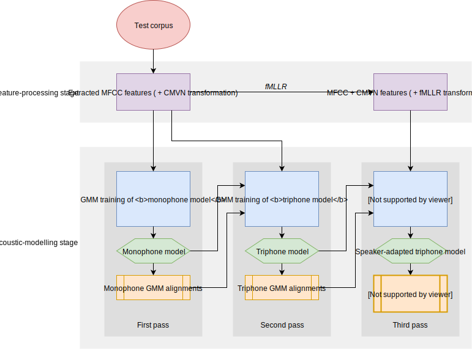
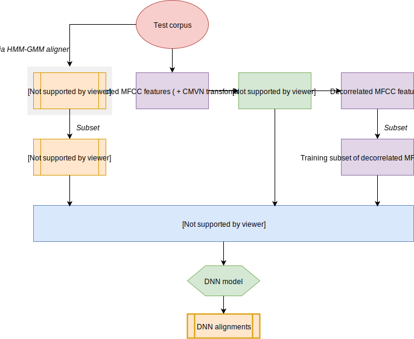
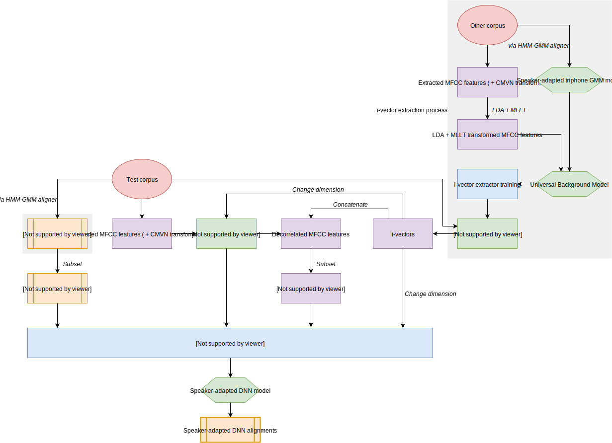

.. _`nnet2`: http://kaldi-asr.org/doc/dnn2.html

.. _`GitHub`: https://github.com/MontrealCorpusTools/Montreal-Forced-Aligner

.. _`mailing list`: https://groups.google.com/forum/#!forum/mfa-users

.. _alignment_techniques:

********************
Alignment techniques
********************

.. warning::

   This page is currently out of date with respect to 1.1 and needs updating.  Many of the general statements remain
   true, but the general pipeline for training was significantly overhauled.  See :ref:`whats_new_1.1` for more details.

This page outlines the actual functioning of the Montreal Forced Aligner, for academics
and developers interested in modeling techniques.

The Montreal Forced Aligner by default uses a Hidden Markov Model-Gaussian Mixture Model
(HMM-GMM) technique to perform acoustic model training and subsequent alignment. This
consists of three training passes. 

1. First, using *monophone models*, where each phone is modelled the same regardless of phonological context. 

2. Second, using *triphone models*, where context on either side of a phone is taken into account for 
   acoustic models. 

3. Third, using *speaker-adapted triphone models* which take into account speaker 
   differences and calculates an fMLLR transformation of the features for each speaker.

A schematic diagram of this technique can be found below:

Inputs
======

The user interacts with the Montreal Forced Aligner through the command line, where the
argument structure determines whether the user wants to train an acoustic model on the test
corpus or use a pretrained model. This page will assume the former, although the latter's
structure besides the actual training is largely similar.

The user's command to train and align on a dataset is parsed by ``aligner/command_line/train_and_align.py``,
whose function ``align_corpus()`` instantiates a variety of objects:

* A Corpus (:ref:`corpus_api`), which contains information about the speech dataset, including Mel-frequency cepstral coefficient features (MFCCs), according to the audio provided;
* A Dictionary (:ref:`dictionary_api`), which contains pronunciation and orthographic information about the language, according to the dictionary provided;
* A TrainableAligner (:ref:`aligner_api`), whose functions will perform training and alignment using the Corpus and the Dictionary.

The TrainableAligner then performs passes of training, exporting output TextGrids at the end of each pass.

.. note:: For the pretrained case, the Aligner object created is instead a Pretrained Aligner. In addition, the pretrained acoustic model is instantiated as an AcousticModel object (:ref:`model_api`).

First (Monophone) Pass
======================

The TrainableAligner's function :meth:`aligner.aligner.TrainableAligner.train_mono()` executes the monophone training.

The monophone training is initialized by :meth:`aligner.aligner.TrainableAligner._init_mono()`, which uses the following
multiprocessing functions to set up the monophone system, compile its training graphs, and produce a zeroth alignment,
which simply gives equal length to each segment.

.. currentmodule:: aligner.multiprocessing

.. autosummary::
   :toctree: generated/
   :template: function.rst

   compile_train_graphs
   mono_align_equal

Next, monophone training is continued by :meth:`aligner.aligner.TrainableAligner._do_mono_training()`. This function itself calls :meth:`aligner.aligner.BaseAligner._do_training()` with the appropriate parameters for the monophone pass, which uses the following multiprocessing functions to train the monophone system in a loop and then produce a first alignment.

.. autosummary::
   :toctree: generated/
   :template: function.rst

   align
   acc_stats

Finally, :meth:`aligner.aligner.TrainableAligner.export_textgrids()` exports the output aligned TextGrids.

Second (Triphone) Pass
======================

The TrainableAligner's function :meth:`aligner.aligner.TrainableAligner.train_tri()` executes the triphone training.

The triphone training is initialized by :meth:`aligner.aligner.TrainableAligner._init_tri()`, which uses the following
multiprocessing functions to set up the triphone system, construct a decision tree (since not all possible triphones
will appear in the dataset), and prepare the alignments from the first (monophone) pass for use in training:

.. autosummary::
   :toctree: generated/
   :template: function.rst

   tree_stats
   compile_train_graphs
   convert_alignments

Next, triphone training is continued by :meth:`aligner.aligner.TrainableAligner._do_tri_training()`. This function itself calls
:meth:`aligner.aligner.BaseAligner._do_training()` with the appropriate parameters for the triphone pass, which uses the following
multiprocessing functions to train the triphone system in a loop and then produce a second alignment.

.. autosummary::
   :toctree: generated/
   :template: function.rst

   align
   acc_stats

Finally, :meth:`aligner.aligner.TrainableAligner.export_textgrids()` exports the output aligned TextGrids.

Third (Speaker-Adapted Triphone) Pass
=====================================

The TrainableAligner's function :meth:`aligner.aligner.TrainableAligner.train_tri_fmllr()` executes the speaker-adapted
triphone training.

The speaker-adapted triphone training is initialized by :meth:`aligner.aligner.TrainableAligner._init_tri()` with
``fmllr=True``, which uses the folowing multiprocessing functions to set up the triphone system, construct a decision
tree, and prepare the alignments from the second (triphone) pass for use in training:

.. autosummary::
   :toctree: generated/
   :template: function.rst

   tree_stats
   compile_train_graphs
   convert_alignments

Next, speaker-adapted triphone training is continued by :meth:`aligner.aligner.TrainableAligner._do_tri_training()` with
``fmllr=True``. This function itself calls :meth:`aligner.aligner.BaseAligner._do_training()` with the appropriate 
parameters for the speaker-adapted triphone pass, which uses the following multiprocessing functions to calculate the
fMLLR transform, train the speaker-adapted triphone system in a loop, and then produce a third alignment.

.. autosummary::
   :toctree: generated/
   :template: function.rst

   align
   acc_stats
   calc_fmllr

Finally, :meth:`aligner.aligner.TrainableAligner.export_textgrids()` exports the output aligned TextGrids.

Normally, this is the end of the pipeline: the corpus has now been aligned according to the HMM-GMM framework.

Deep Neural Networks (DNNs)
===========================

.. note:: The DNN framework for the Montreal Forced aligner is operational, but may not give a better result than the alignments produced by the standard HMM-GMM pipeline. Preliminary experiments suggest that results may improve when the DNN model used to produce alignments is pre-trained on a corpus similar in quality (conversational vs. clean speech) and longer in length than the test corpus. 

   Since the code is newly developed, if you run into any issues, please contact us on the `mailing list`_ or on `GitHub`_.

The Montreal Forced Aligner also has the capacity to use DNNs for training, thus creating an HMM-DNN framework
on top of the existing HMM-GMM framework. This functionality is based on Kaldi's `nnet2`_ recipes.

The basic idea behind this functionality is to train a DNN using a subset of the 
HMM-GMM alignments as the gold-standard data. Despite the fact that the DNN is technically trained to make the
same predictions as the third pass alignments, due to the nature of DNNs, they may be able to learn a better
acoustic model representation than what the GMMs were able to achieve.

The analogue to speaker adaptation in the HMM-DNN framework is the use of i-vectors, which can be thought of as
"speaker embeddings" that we append to the acoustic features. These are calculated by an i-vector extractor, which
has its own training pipeline. For now, only a pretrained model is available: the i-vector extractor used is by 
default trained on a 100-hour subset of Librispeech.

A schematic diagram of this technique can be found below:

Fourth (DNN) Pass
-----------------

The TrainableAligner's function :meth:`aligner.aligner.BaseAligner.train_nnet_basic()` executes the DNN training.

First, i-vectors are extracted from the test corpus by :meth:`aligner.aligner.BaseAligner._extract_ivectors()`, which
uses the following multiprocessing function:

.. autosummary::
   :toctree: generated/
   :template: function.rst

   extract_ivectors

Next, an LDA-like transform is applied to the features with appended i-vectors, in order to decorrelate them, which
uses the following multiprocessing function:

.. autosummary::
   :toctree: generated/
   :template: function.rst

   get_lda_nnet

Then, a subset of training examples is amassed, using the following multiprocessing function:

.. autosummary::
   :toctree: generated/
   :template: function.rst

   get_egs

Then the DNN is in initialized. Following nnet2, it is a DNN with a p-norm activation function with online
preconditioning, and its output component is a softmax nonlinearity. About halfway through training, the DNN
*mixes up*, copying components of the weight matrix and allowing them to independently develop probability
distributions for different realizations of the same phone. The main training loop works through stochastic
gradient descent and uses the following multiprocessing functions:

.. autosummary::
   :toctree: generated/
   :template: function.rst

   nnet_train_trans
   nnet_train
   get_average_posteriors
   relabel_egs

Finally, an alignment is generated, using the following multiprocessing functions:

.. autosummary::
   :toctree: generated/
   :template: function.rst

   compile_train_graphs
   nnet_align

The output TextGrids from the DNN alignment are exported by :meth:`aligner.aligner.TrainableAligner.export_textgrids()`.

Appendix: I-Vector Extractor Training
-------------------------------------

.. note:: This appendix describes the training pipeline for the i-vector extractor. Currently this is not configurable from the command line, and only pretrained models are available. However, for the sake of completeness, its structure is outlined here.

The pipeline consists of three steps:

1. An *LDA + MLLT (Maximum Likelihood Linear Transform) transformation* is applied to the features of a corpus.
2. A *diagonal UBM (Universal Background Model)* is generated from several GMMs fit to these features.
3. An *i-vector extractor* is trained from the corpus data and the UBM.

Then, the i-vector extractor is used during DNN training to extract i-vectors representing the properties of the speaker.

A schematic diagram of this technique can be found below:

LDA + MLLT
~~~~~~~~~~

The TrainableAligner's function :meth:`aligner.aligner.BaseAligner.train_lda_mllt()` executes the LDA + MLLT
transformation. 

The LDA + MLLT transformation is initialized by :meth:`aligner.aligner.TrainableAligner._init_lda_mllt()`, which
uses the following multiprocessing functions to set up the system, construct a decision tree, and prepare the
alignments from the previous pass:

.. autosummary::
   :toctree: generated/
   :template: function.rst

   lda_acc_stats
   tree_stats
   convert_alignments
   compile_train_graphs

Next, training is continued by :meth:`aligner.aligner.TrainableAligner._do_lda_mllt_training()` with ``lda_mllt=True``.
This function itself calls :meth:`aligner.aligner.BaseAligner._do_training()` with the appropriate parameters for the
LDA + MLLT pass, which uses the following multiprocessing functions to calculate the LDA + MLLT transform.

.. autosummary::
   :toctree: generated/
   :template: function.rst

   align
   acc_stats
   calc_lda_mllt

Diagonal UBM
~~~~~~~~~~~~

The TrainableAligner's function :meth:`aligner.aligner.TrainableAligner.train_diagonal_ubm()` executes the Diagonal
UBM training, using the following multiprocessing functions:

.. autosummary::
   :toctree: generated/
   :template: function.rst

   gmm_gselect
   acc_global_stats

I-Vector Extractor
~~~~~~~~~~~~~~~~~~

The TrainableAligner's function :meth:`aligner.aligner.TrainableAligner.ivector_extractor()` executes the i-vector
extractor training.

The i-vector extractor training is initialized and continued by :meth:`aligner.aligner.TrainableAligner._train_ivector_extractor`,
which uses the following multiprocessing functions:

.. autosummary::
   :toctree: generated/
   :template: function.rst

   gauss_to_post
   acc_ivector_stats

.. note:: The i-vector extractor is represented as an IVectorExtractor object (:ref:`model_api`).