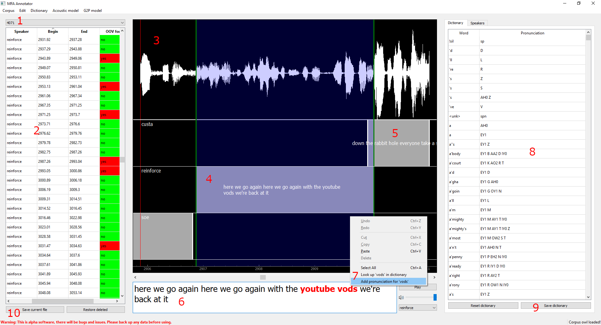
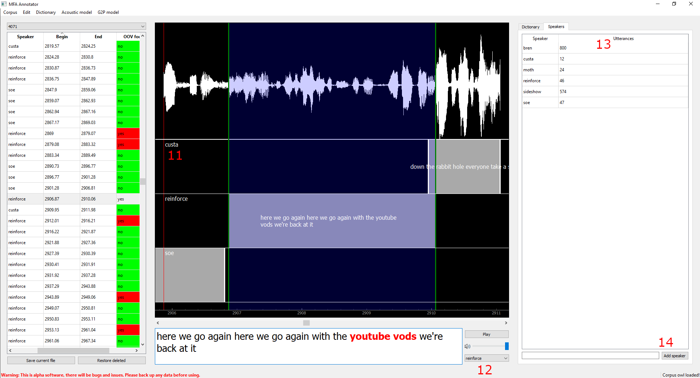

.. _`LAV filters`: https://github.com/Nevcairiel/LAVFilters/releases

.. _annotator:

**********
MFA Anchor
**********

Anchor is a GUI utility for MFA that allows for users to modify transcripts and add/change entries in the pronunciation dictionary to interactively fix out of vocabulary issues.

.. attention::

   Anchor is under development and is currently pre-alpha. Use at your own risk and please use version control
   or back up any critical data.

To use the annotator, first follow the instructions in :ref:`installation`.  Once MFA is installed and thirdparty binaries
have been downloaded, run the following command:

.. code-block:: bash

    mfa anchor

.. warning::

   If you are trying to use the annotator from Windows, note that some issues will be present as native Windows use is not
   fully supported. Specifically if you need G2P functionality, that does not function on Windows due to its dependencies
   not being available (Pynini, Opengrm-ngram, OpenFst).

Initial setup
=============

To load a corpus for inspection, go to the Corpus drop down menu and select "Load a corpus".  Navigate
to the desired corpus directory.  Please note that it should follow one of the data formats outlined in :ref:`data_format`.

.. note::

   Some set up of system codecs may be necessary to playback those types of files.  For Windows, `LAV filters` has been
   tested to work with :code:`.flac` files.

Next, dictionary files and G2P models should be loaded via their respective menus.  If any pretrained
models have been installed via :ref:`pretrained_models`, these can be selected directly.

Fixing out of vocabulary issues
===============================

Once the corpus is loaded with a dictionary, utterances in the corpus will be parsed for whether they contain
an out of vocabulary (OOV) word.  If they do, they will be marked in that column on the left with a red cell
(see number :code:`2` below).

To fix a transcript, click on the utterance in the table.  This will bring up a detail view of the utterance,
with a waveform window above and the transcript in the text field.  Clicking the ``Play`` button (or ``Tab`` by default)
will allow you to listen to the audio.   Pressing the ``Save current file`` button (see number :code:`10` below) will save the
utterance text to the .lab/.txt file or update the interval in the TextGrid.

.. warning::

   Clicking ``Save`` will overwrite the source file loaded, so use this software with caution.
   Backing up your data and/or using version control is recommended to ensure that any data loss
   during corpus creation is minimized.

If the word causing the OOV warning is in fact a word you would like aligned, you can right click on
the word and select ``Add pronunciation for 'X'`` if a G2P model is loaded (see number :code:`7` below).  This will run the G2P
model to generate a pronunciation in the dictionary which can then be modified if necessary and the dictionary
can be saved via the ``Save dictionary`` button.  You can also look up any word in the pronunciation
dictionary by right clicking and selecting ``Look up 'X' in dictionary``.  Any pronunciation can be modified
and saved.  The ``Reset dictionary`` button wil discard any changes made to the dictionary.

Fixing segments
===============

The file you want to fix up can be selected via the dropdown in the top left (number :code:`1` above).

For fixing up intervals, you can select segments in the left table (number :code:`2` above), or by clicking on
intervals in the plot window (i.e., number :code:`5` above).
You can edit the text in the center bottom box (number :code:`6` above), change the speaker via the dropdown next to the
text box (number :code:`12` below), and adjust
boundaries as necessary (green lines associated with number :code:`4` below).  If you would like to add a new speaker,
then it can be accessed via the :code:`Speaker` tab
on the right pane, which will also list counts of utterances (see :code:`13` below). Entering a speaker name and clicking
"Add speaker" (:code:`14` below), will make that speaker available in the dropdown.

Single segments can be split via a keyboard shortcut (by default :code:`Ctrl+S`, but this can be changed, see
:ref:`configure_annotator` for more details).  This will create two segments from one, split at the midpoint, but with all
the text in the first segment.

Multiple segments can be selected by holding :code:`Ctrl` (with selections shown in the left pane, though not in the waveform panel),
and can be merged into single
segments via a keyboard shortcut (by default :code:`Ctrl+M`, but this can be changed, see :ref:`configure_annotator`
for more details).  Any number of segments can be selected this way, and the resulting merged segment will concatenate
the transcriptions for them all.  In general, be cautious about creating too long of utterances, as in general there
is better performance in alignment for shorter utterances, and often breath pauses make for good segment boundaries if
they're visible on the waveform.

Segments can be added via double clicking on a speaker's tier (i.e., number :code:`11`), however, it is disabled if a
segment exists at that point. Any segments can also be deleted via a shortcut (by default :code:`Delete`).  There is limited
restore functionality for deleted utterances, via a button on the bottom left.

.. _configure_annotator:

Configuring the annotator
=========================

By going to :code:`Preferences` in the :code:`Edit` menu, many aspects of the interface can be changed.  The two primary
customizations currently implemented are for the appearance of the waveform/segment window and for  keyboard shortcuts.

The current available shortcuts are:

.. csv-table::
   :header: "Function", "Default keybind"

   "Play audio", "Tab"
   "Zoom in", "Ctrl+I"
   "Zoom out", "Ctrl+O"
   "Pan left", "Left arrow"
   "Pan right", "Right arrow"
   "Merge utterances", "Ctrl+M"
   "Split utterances", "Ctrl+S"
   "Delete utterances", "Del"
   "Save current file", "By default not bound, but can be set"
   "Create new segment", "Double click (currently not rebindable)"

Attribution
===========

The MFA annotator utility uses icons from FontAwesome